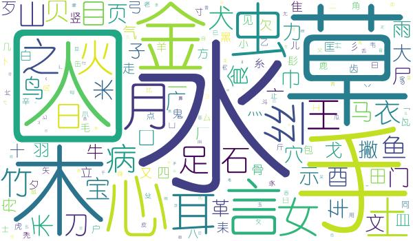

# Chinese Character Components

## “加偏旁，组新字”, 记住这个口诀，再也不用愁!

女儿上小学了，在语文测试中，出现了“加偏旁，组新字”的题目，她会的字挺多，但就是她经常想不起有哪些偏旁可以加……
怎么办？ 要是能编个口诀帮她快速想起都有哪些偏旁就好了！

那么多偏旁，哪些偏旁是比较常见的呢？身为码农的我，写了这个程序，分析了6500个常用汉字的偏旁：



分析发现“二八定律”再次生效——40个偏旁（占所有偏旁的20%不到）组成了近80%的汉字。
考虑到一般组新字可加的偏旁有多个，所以覆盖了80%的字的这些偏旁，可以近乎100%搞定这种题目了。

通过人工智能（没错，是“人工”、“人工”），把这40个偏旁，按“五言律诗”的形式，编了个口诀。记住这个口诀，“加偏旁，组新字”，再也不用愁！

### 偏旁口诀
```
金木水火土
耳目手口足
人言衣食病
禾米草丝竹

鱼虫犬马鸟
女王心之宝
车门酉贝页
山石日月刀
```

### 随便找几个字试试

1. **交**

 偏旁口诀               | 组新字
-----------------------|------------
**金木**水火土          | 校、
**耳**目手**口足**      | 郊、咬、跤
**人**言衣**食**病      | 佼、饺
禾米草**丝**竹          | 绞
**鱼虫犬**马鸟          | 鲛、蛟、狡
**女**王心之宝          | 姣
**车**门酉贝页          | 较
山石日**月**刀          | 胶

2. **皮**

 偏旁口诀               | 组新字
-----------------------|------------
金木**水**火**土**      | 波、坡
**耳**目口**手**足      | 披
**人**言**衣**食**病**  | 彼、被、疲
禾米草丝竹              |
鱼虫犬马鸟              |
女**王**心之宝          | 玻
车门酉贝**页**          | 颇
山**石**日月刀          | 破


### 附：偏旁名称对应的偏旁及字数

偏旁名称|字数 |包含的偏旁
-------|----|---------
水|382|冫,氵,水
口|320|口
草|309|艹
手|280|扌,手
木|277|木
人|266|亻,人,彳
金|197|钅,金
心|186|心,忄
言|150|言,讠
虫|144|虫
月|139|月
耳|139|卩,阝,耳
丝|134|纟
土|133|土
女|124|女
之|100|辶
火|98|火
王|97|王
竹|96|竹
足|90|足
病|89|疒
日|87|日
石|87|石
山|80|山
目|74|目
衣|71|衣,衤
犬|66|犬,犭
贝|63|贝
鱼|63|鱼
刀|63|刂,刀
宝|59|宀
鸟|59|鸟
马|50|马
禾|49|禾
食|48|饣,食,飠
车|45|车
酉|45|酉
门|45|门
页|43|页
米|42|米


## 程序说明

1. **采集汉字及其偏旁**

    执行```python collector.py```，启动爬虫，从“百度汉语”和“国学大师”两个网站采集汉字及其对应的偏旁。采集的数据存储到data目录中。
    （注：已经采集并写到文件中的字，不会再重复采集了。）

2. **对偏旁进行统计分析**

    执行```python analyzer.py```，进行统计分析，分析结果输出到output目录中。